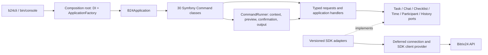

# Design

## Context

Мотивация — в [proposal.md](proposal.md). Контракты — [cli-experience](../../specs/cli-experience/spec.md), [task-mvp-scope](../../specs/task-mvp-scope/spec.md) и [новая delta](specs/task-console-runtime/spec.md).

Исходное состояние до разрешённого apply 2026-10-09 в worktree issue #10: `bin/console` создаёт standalone Symfony Application без прикладных команд; `src/` не содержит реализации команд; `vendor/` отсутствует. В `composer.lock` закреплены Console 8.1.8 и b24phpsdk 3.7.0. PSR-4 namespace — `Bitrix24\CLI\`. FrameworkBundle и DependencyInjection сейчас не установлены. После разрешения пользователя реализация создана в этом change; фактические файлы и local/portal границы перечислены в [implementation-verification](implementation-verification.md).

Каталог [define-task-jtbd](../define-task-jtbd/cli-candidates.json) содержит 59 исследованных операций: **30 MVP / 0 API-policy-pending / 29 после MVP**. Название CLI не обязано совпадать с методом API. Полное покрытие 19 продуктовых JTBD не обещается текущим MVP.

## Goals / Non-Goals

**Goals:** команды используют стандартные Symfony InputDefinition/help/list; DI собирает явно выбранные сервисы; подключение возникает только при выполнении операции; ввод, результат, ошибки и API policy имеют общие границы. Каждую команду можно проверить офлайн и отдельно принять на портале.

**Non-Goals:** FrameworkBundle, Kernel, HTTP-приложение, ORM, message bus, общий REST proxy, универсальный workflow engine, OAuth login/token storage, установка shell completion и выпуск пакета. Из post-MVP ничего не возвращается. На исходном этапе проектирования PHP не менялся; теперь реализуется согласованный MVP.

## Decisions

### 1. Console и DI как самостоятельные компоненты

Используем `symfony/console:^8.0` и `symfony/dependency-injection:^8.0`. Нам нужны разбор CLI и сборка объектов; полноценный framework lifecycle не требуется. DI поддерживает standalone контейнер и compiler passes; Console поддерживает загрузку команд из PSR-11 контейнера ([DI](https://symfony.com/doc/current/service_container.html), [compiler passes](https://symfony.com/doc/current/service_container/compiler_passes.html), [lazy commands](https://symfony.com/doc/current/console/lazy_commands.html)).

Ручная сборка всех зависимостей возможна, но при 30 командах увеличивает bootstrap и затрудняет замену адаптеров в проверках. FrameworkBundle дал бы conventions/configuration, ценой лишнего framework lifecycle и зависимостей. Выбираем DI с небольшим собственным composition root; решения по API остаются прикладными сервисами.

### 2. Направление зависимостей

Console зависит от Application; Application зависит от своих портов и обычных DTO. Infrastructure реализует порты и знает SDK. Composition root единственный знает конкретные реализации всех слоёв. У application handler нет Symfony Input/Output, контейнера или SDK Response. У команды нет REST method strings, версий API и credentials.

Это слои одного CLI-процесса, без разнесения по отдельным сервисам/пакетам. Альтернатива «SDK прямо в каждой команде» короче сначала, но дублирует проверки, версии и форматирование. Отдельные доменные агрегаты для простого CRUD пока не нужны.

### 3. Сборка приложения и регистрация

| Компонент | Ответственность |
| --- | --- |
| `Bootstrap/ContainerFactory` | Создать ContainerBuilder, загрузить PHP service definitions, добавить compiler pass, compile; не получать credentials |
| `Bootstrap/ApplicationFactory` | Создать B24Application, передать loader, общие сервисы и build version |
| `Console/B24Application` | Глобальная InputDefinition, error boundary и безопасный выбор команд |
| `Bootstrap/RegisterTaskCommandsPass` | Собрать явные `console.command` tags, проверить уникальность/имена/точный MVP набор и сформировать name → service ID |
| `config/services.php` | Явные определения 30 команд, autowiring конструкторов и aliases порт → адаптер |
| `bin/b24cli`, `bin/console` | Два тонких launcher одного ApplicationFactory; публичное имя приложения — b24cli |

Каждый Command имеет `AsCommand` с полным именем и явное service definition/tag. В standalone Console атрибут сам не сканирует `src/` и не регистрирует сервис: карту строит наш pass. Не включаем массовое сканирование namespace, которое могло бы случайно зарегистрировать исключённую команду. Pass сравнивает tag и AsCommand, запрещает aliases post-MVP и несогласованные имена. Будущая компактная карта runtime содержит только имя/класс/effect; весь исследовательский каталог из `openspec/` не загружается при запуске.

`ContainerCommandLoader` получает контейнер и карту команд ([закреплённый исходник](https://github.com/symfony/console/blob/4b81146e3ee248ea969186f85499b54fbc78db08/CommandLoader/ContainerCommandLoader.php)). Только command services доступны loader как public; обработчики, порты и SDK provider private и внедряются конструкторами. Доступ к контейнеру внутри команд/обработчиков запрещён. Альтернатива — отдельный ServiceLocator с private commands; для этого MVP public граница из 30 команд проще и достаточна.

Конструкторы и `configure()` только задают определения и сохраняют зависимости. Создание SDK client откладывается до вызова метода provider. Поэтому даже если list/help создают несколько Command objects, сетевых запросов и чтения секретов не происходит. Контейнер компилируется один раз на invocation; dumped cache пока не вводится. Оптимизация холодного старта допустима после измерений, с изоляцией по checkout и без credentials в дампе.

Встроенные `help`, `list`, `completion` и служебная `_complete` остаются Symfony-командами и не входят в число 30. Completion предлагает имена/опции из локальной InputDefinition, без запросов значений на портал.

### 4. Одна операция CLI — один Command

30 отдельных final Command классов наследуют Symfony Command и используют `configure()`/`execute()`. Это поддерживается закреплённой версией; основной обзор текущих docs показывает и invokable commands ([Console docs](https://symfony.com/doc/current/console.html), [Command source](https://github.com/symfony/console/blob/4b81146e3ee248ea969186f85499b54fbc78db08/Command/Command.php)). Здесь обычный Command удобен для явной InputDefinition, конфликтов опций, проверки присутствия поля и CommandTester.

В каждом классе остаются определение ввода/справки, сборка typed Request через общие input helpers и передача в конкретный handler через CommandRunner. Не делаем одну огромную TaskCommand с action switch и не связываем группы команд с SDK сервисами 1:1. Общий BaseTaskCommand с бизнес-логикой не нужен: повторяющийся цикл выполнения вынесен в сервис, а не в иерархию наследования.

[Карта всех 30 команд](command-map.md) задаёт имя, класс, Request/Handler, маршруты, preflight и output profile. Классы команд находятся в `Console/Command/Task`, requests/handlers — в `Application/Task/Request` и `Application/Task/Handler`. Имена в карте задают обязательные классы будущей реализации.

`task:update`, `task:assign`, `task:deadline:set` передают `UpdateTaskRequest` в `UpdateTaskHandler`. Request содержит operation identity и patch; политика allowlist различается: общие writable поля / только responsibleId / только deadline. В результате **30 Command классов и 28 handlers**; общие сервисы поиска/валидации не являются отдельными CLI операциями. Message bus, service lookup по строке и новые сущности CQRS для этого не нужны.

### 5. InputDefinition и локальная валидация

Глобальные проектные опции добавляются один раз через `B24Application::getDefaultInputDefinition()` с сохранением parent definition: `--json`, `--plain`, `--profile NAME`, `--config PATH`, `--timeout SECONDS`. Это не profiler option FrameworkBundle. Нативные `-h`, `-V`, `-q`, `-v/-vv/-vvv`, `--silent`, `-n`, `--ansi/--no-ansi` сохраняют значения. Они должны одинаково работать до/после имени команды.

| Ввод | Symfony mode и проверка |
| --- | --- |
| `TASK_ID` | REQUIRED argument, положительный integer; не применять ко всему task:list/find |
| `--message`, `--entry`, `--checklist`, `--item`, `--parent` | VALUE_REQUIRED option с проверкой роли ID; required business option проверяется явно |
| `--select`, `--order`, `--id`, `--file-id`, `--accomplice`, `--auditor` | VALUE_REQUIRED + VALUE_IS_ARRAY; повторение опции, без скрытого comma parser |
| Текст, dates, numeric limits, JSON/PATH | VALUE_REQUIRED; `VALUE_REQUIRED` требует значение у переданной опции, но не делает саму опцию обязательной |
| `--all`, `--dry-run`, `--force`, clear-role flags | VALUE_NONE; dry-run у write/delete, force только у delete |

`OptionPresence` сохраняет факт передачи: omission не равна `--description ""`; defaults не добавляются в patch. `InputSourceReader` читает только явно выбранный файл или `-`, запрещает два потребителя stdin и `-` при TTY. `InputValidator` проверяет IDs, непустые title/text, JSON object, integer limits/seconds, ISO8601 со смещением часового пояса, взаимоисключающие опции. Проверки выполняются до credentials/network. Нет wizard для пропущенных значений.

Создание: обычные флаги вместе либо отдельный advanced `--fields/--fields-file` object; title/creatorId/responsibleId обязательны в итоговом режиме. Advanced не смешивается с полевыми флагами, как требует `cli-experience`. В старом design/catalog оставалось разрешение смешивания create fields; этот текст приводится к актуальному нормативному UX. Update требует минимум один patch field, отсекает unknown/read-only/status до mutation. Writable metadata при необходимости читается явно v3 field.list/get; статический запрет lifecycle действует даже если metadata объявит status writable.

`task:list`: удобные predicates и `--where/--where-file` — разные режимы. MVP local where object поддерживает только равенство по `id`, `title`, `creatorId`, `responsibleId`, `groupId`, `status`, `deadline`; values типизированы, несколько полей означают AND. Relation IDs нормализуются адаптером. `--id` остаётся server id filter и может ограничить advanced scan; date comparison предоставляет явный --due-before. Другие operators/DSL отклоняются. `--order FIELD:asc|desc` передаётся только для documented v3 sort fields, без имитации legacy API.

`--params` не является pass-through всего HTTP payload. У time:list это ограниченный query object `order/filter/select/params`: поля из documented elapsed-item schema, `params` только NAV_PARAMS с размером страницы 1..50 и номером ≥1. Task ID задаётся positional и не переопределяется. У history:list разрешены только `filter.FIELD` и `order.createdDate`; неизвестные ключи отклоняются. Адаптеры переводят эту форму в конкретный контракт API ([time list](https://apidocs.bitrix24.ru/api-reference/tasks/elapsed-item/task-elapsed-item-get-list.html), [history](https://apidocs.bitrix24.ru/api-reference/tasks/tasks-task-history-list.html)). Навигация preflight принадлежности управляется приложением и не наследует пользовательский фильтр списка.

Рабочее предположение по последнему scope решению: удалена только отдельная `task:subtask:add`; явный parentId ordinary task:add advanced fields сохраняется. Shortcut `--parent` для task:add и alias не вводятся. Это предположение уже отмечено в scope; при уточнении полного запрета подзадач до apply корректируются validator и scenario. `--parent` у checklist item относится к дереву пунктов, а не задач.

### 6. Общий цикл выполнения

1. Symfony выбирает Command и разбирает ввод; mapper/validator формируют typed Request.
2. CommandRunner создаёт InvocationContext: output mode, verbosity, connection selector, API policy, timeout, cancellation. Config precedence: invocation → выбранный config → environment → defaults. Пользователь согласовал root .env с BITRIX24_WEBHOOK. EnvConnectionResolver читает .env только при execution, без override переменных процесса; credentials приходят только через ConnectionResolver.
3. Handler объявляет весь возможный маршрут, включая дополнительные чтения. ApiPolicyGuard проверяет его **до первого API call**. Затем resolver/provider получают подключение, handler выполняет разрешённые preflight reads и возвращает PreparedOperation.
4. При dry-run presenter показывает цель, patch, возможные шаги и выполненные чтения; мутации и prompts отсутствуют.
5. При delete ConfirmationPolicy проверяет force/interactive stdin. Без force в non-TTY/-n — usage exit2, по возможности до remote read. В TTY показывает тип/ID/название цели; явный отказ пользователя — cancelled exit130 без mutation.
6. Handler выполняет подготовленные шаги через порты. Mutation не повторяется автоматически. ExecutionLedger учитывает подтверждённые, skipped и outcome-unknown шаги. Cancellation проверяется между запросами.
7. Handler возвращает OperationResult; ResultPresenter выбирает human/plain/JSON, ExitStatusMapper возвращает код.

Runner получает конкретные typed prepare/execute callbacks handler, без общего bus или интерпретатора произвольных plan steps. PreparedOperation хранит validated target/patch и display plan, а не SDK objects или credentials. Порты выполняют конкретные операции. Plan служит для policy, dry-run и evidence; он не даёт пользователю возможность исполнить произвольный REST маршрут.

Обычная запись не требует дополнительного подтверждения. Force не отменяет policy, ID binding, field validator или серверные права. Preflight не устраняет гонку с последующей записью; сервер остаётся последней проверкой доступа и состояния.

### 7. Порты, адаптеры и явные версии API

| Application port | Infrastructure adapter | Граница |
| --- | --- | --- |
| `TaskGateway` | `Rest3TaskAdapter` | Карточка/выборки/field metadata/access/file attach/elapsedTime; только REST3 |
| `TaskChatGateway` | `TaskChatAdapter` | REST3 send; task→chat v3 lookup; history/update/delete через выбранные IM REST1 companions |
| `ChecklistGateway` | `Rest1ChecklistAdapter` | 8 root/item команд, дерево, явный PARENT_ID |
| `TimeEntryGateway` | `Rest1TimeEntryAdapter` | 4 elapseditem команды и проверка ENTRY_ID внутри TASK_ID |
| `ParticipantGateway` | `Rest1ParticipantAdapter` | Только accomplice/auditor replacement/clear, без общего update payload |
| `TaskHistoryGateway` | `Rest1TaskHistoryAdapter` | Доступная история изменений задачи, отдельно от IM |
| `ConnectionResolver` | EnvConnectionResolver (webhook, выбран пользователем) | Profile/config selector → secret-safe connection; фиктивное подключение в offline tests |

Общий `B24ClientProvider` лениво создаёт SDK ServiceBuilder/Core из connection. В SDK 3.7.0 `Core::call` по умолчанию использует v1; adapters обязаны выбирать enum `Bitrix24\SDK\Core\Contracts\ApiVersion::v1/v3` явно ([Core](https://github.com/bitrix24/b24phpsdk/blob/8ebd4c154d5557db949b0196825f347a3a6c5bf0/src/Core/Core.php), [enum](https://github.com/bitrix24/b24phpsdk/blob/8ebd4c154d5557db949b0196825f347a3a6c5bf0/src/Core/Contracts/ApiVersion.php)). Wrapper допустим только при совпадении закреплённого контракта/версии; известные gaps реализуются явным Core call внутри адаптера. Например, checklist add wrapper не принимает PARENT_ID, поэтому root/item add идут через Core v1. Известные API/SDK mappings сохранены в каталоге.

ApiPolicyGuard использует allowlist operation → method/version/field scope. `tasks.task.update` REST3 для карточки и одноимённый REST1 для participants — разные разрешения. Legacy admission 14 команд не разрешает общий v1 task CRUD. IM history не заменяется task.commentitem. При строгой политике смешанный план отклоняется целиком, до v3 lookup. Переключения версии после отказа сервера нет.

В `command-map.md` основные маршруты дословно сверяются с catalog method_routes. Дополнительные preflight отдельно отмечены как **проектные чтения**, а не новая API evidence или мутации: v3 get перед удалением/participants и v3 field metadata для advanced validation; IM history для binding message; elapseditem getlist для binding entry. Они используют уже выбранные API семейства и проходят policy; лишний новый API exception не вводится.

### 7a. Уточнения по интеграционным тестам SDK 3.7.0

Используется pinned SDK 8ebd4c154d5557db949b0196825f347a3a6c5bf0. Update/assign/deadline передают sparse array, без TaskItemBuilder создания. Writable metadata использует editable=true плюс CLI allowlist. List/find идут через Core с явным ApiVersion::v3, без SDK REST1 batch list. Send получает boolean ACK без ID; подтверждённый send возвращает resourceId=null и success, без outcomeUnknown или поиска по тексту. elapsedTime — связанное поле карточки, без гарантии суммы/полноты. Checklist SORT_INDEX нормализуется в sortIndex, Y/N — в bool. History user.id/value.from/value.to и IM date/author_id переводятся в поля output profiles; nullable ACL сохраняет null, SDK userId=0 не считается identity. File attach отправляет один fileId на отдельный request для каждого ledger step. Remote ValidationException сохраняет безопасные field/message с api-validation-error и exit1.

Root .env находится в checkout; BITRIX24_WEBHOOK — входящий webhook. Для Docker внешний root .env выбирается через B24CLI_ENV_FILE и read-only bind mount, без secret argv. Переменные процесса имеют приоритет над .env; help/parse/strict policy denial не читают .env. SDK Core/ServiceBuilder создаются лениво, HttpClient получает конечные timeout/max_duration и NullLogger. OAuth/ApplicationBridge и token refresh storage не реализуются этой пачкой. Integration suite запускается явно и пропускается без webhook; выделенная тестовая задача создаётся/удаляется с cleanup, без массовой очистки портала.

### 8. Binding, пагинация и полнота

Для chat:update/delete handler получает TASK_ID → chat.id/entityId/entityType через v3 get, проверяет task association, затем ищет MESSAGE_ID в IM history нужного DIALOG_ID. MessageBindingVerifier обходит страницы с внутренним budget **10 000 messages**, проверяя progress/dedup; произвольный глобальный MESSAGE_ID не принимается на доверии. При недостаточных данных/не найденном сообщении — binding gate4, никакой записи. Сервер проверяет право автора/администратора; CLI не подменяет author ID.

EntryBindingVerifier получает elapseditem страницы указанной TASK_ID и ищет ENTRY_ID, независимо от пользовательских --params, с budget **10 000 entries**. NodeBindingVerifier собирает getlist дерево одной TASK_ID: root PARENT_ID=0, item parent — корень/потомок того же root, root ID не допускается для item action. Неполное/циклическое дерево, чужой ID, непрочитанный ресурс → gate4 до mutation. Delete пункта по документированному API удаляет и его подпункты: план и подтверждение показывают это дерево, root delete остаётся недоступным ([delete contract](https://apidocs.bitrix24.ru/api-reference/tasks/checklist-item/task-checklist-item-delete.html)).

TaskListScanner выбирает поля для вывода **и** predicates, нормализует relation IDs, применяет только id server filter, остальные фильтры локально. `task:find` использует literal Unicode case-insensitive substring title, trim, id ASC и всегда список id/title. Defaults limit=50, max-scan=10 000; --all снимает лишь output limit. Вывод ограничивается после scan, поэтому matched count и complete не выводятся из числа возвращённых строк. Page error после полученных данных/scan cap/missing predicate field дают partial3; ошибка до данных — execution1. `complete` относится к доступной выборке, не ко всему порталу или неизменному snapshot.

Pagination codecs отдельны: REST3 page/limit/offset; IM before/after IDs; elapseditem позиционный порядок taskId/order/filter/select/params с NAV_PARAMS; history именованные параметры. Размер task page — внутренний 50 с учётом оставшегося scan budget; chat API page default20/max50, клиент обрабатывает и больший фактический ответ. Повторяющийся cursor/страница без progress завершает scan как partial. Бюджеты finite и документируются в help.

Time:list по умолчанию обходит доступные страницы от первой с внутренним budget 10 000; явно заданный iNumPage означает выбранную страницу, meta обозначает этот scope и не обещает полный набор задачи. History endpoint документирует filter/order, а его примеры дополнительно используют start; adapter обходит только подтверждённую response navigation. Если навигацию/конец выборки нельзя доказать, history возвращает имеющиеся данные с complete=false/reason и exit3, без выдуманной legacy/v3 пагинации. Полнота не объявляется на основании короткого ответа. Это конкретный portal acceptance case, не вопрос об изменении архитектуры.

### 9. Результат, форматы и stderr

OperationResult содержит typed user data, output profile и meta. API/SDK responses нормализуются внутри adapters. JSON: один object с `data`, `meta`, `error`; schemaVersion=1. Error null при полном успехе; error object имеет stable code/message/hint, безопасные details и диагностический operation ID. При ошибке до выполнения data=null; при partial сохраняются подтверждённые данные.

Meta включает command/target, использованные method/version, API policy, scope и completeness; у списков — scanned/matched/returned/limitApplied/reasons; у write plan/ledger — confirmed/skipped/unknown steps и outcomeUnknown. Secrets/полный webhook URL не входят ни в plan, ни в meta. `--json` + `--plain` — usage2; для этой ошибки, если --json явно выбран, используется один JSON error envelope. Нативные help/list/version/completion сохраняют собственные форматы, help не превращается в API envelope.

Human presenter показывает карточку/таблицу/короткое подтверждение, диагностику/partial reason отправляет в stderr. Plain presenter выдаёт TSV без header с columns из [карты](command-map.md), escaping backslash/tab/CR/LF; сложное значение — компактный JSON внутри escaped cell, null — пустая cell. JSON/plain не содержат ANSI. Partial plain сохраняет только rows в stdout, completeness diagnostic — stderr. Большие response/debug payload не печатаются автоматически.

Quiet/silent следуют native Symfony: при -q normal stdout, включая JSON, подавлен; существенная ошибка остаётся stderr. Silent подавляет всё. NO_COLOR, TERM=dumb, non-TTY и --no-ansi учитываются по потоку; при --json/--plain отключается decoration независимо от terminal. Progress никогда не попадает в stdout. Основной logger redacts credentials и в verbose; stack trace не показывается обычному пользователю.

### 10. Ошибки охватывают parser и command selection

Обработка только в `Command::execute()` недостаточна: bind/validation выполняются раньше. В Console 8.1.8 interactive unknown-command path может предложить единственную похожую команду и запустить её после подтверждения ([Application source](https://github.com/symfony/console/blob/4b81146e3ee248ea969186f85499b54fbc78db08/Application.php)). Наш UX требует остановки с usage error.

B24Application сохраняет native parser/dispatcher, но оборачивает `run()` общей failure boundary. Parent application настраивается с autoExit=false, catchExceptions=false, catchErrors=false; throwable попадает в единственный FailureMapper/ResultPresenter, включая ошибки configureIO/doRun/bind. Launcher завершает процесс возвращённым int. CommandRunner не ловит и не печатает ту же ошибку повторно: он возвращает success/partial result либо бросает typed failure.

В `find()` исключение unknown/ambiguous команды преобразуется в собственную UsageFailure с alternatives **до** native autocorrect prompt; известные имена и однозначные Symfony abbreviations остаются native. Возможная namespace fallback также не превращает опечатку write в действие. Output mode до полного bind определяется через InputInterface raw option API с `onlyParams=true`, соблюдая разделитель `--`; нельзя искать строку --json в payload регулярным выражением. Два положения global options, aliases verbosity, error-before-execute и separator проверяются на ApplicationTester/subprocess, не только CommandTester.

| Семейство failure | Exit | Stable error codes |
| --- | --- | --- |
| Parser/local input | 2 | usage-error |
| Remote/transport/configuration | 1 | permission-denied, api-validation-error, api-error, transport-error, configuration-error, connection-unavailable |
| Incomplete scan/confirmed partial write | 3 | partial-result |
| Policy/binding | 4 | policy-denied, message-binding-unverified, resource-binding-unverified |
| Ctrl-C/отказ подтверждения | 130 | interrupted, cancelled |

### 11. Timeout, неизвестный результат и отмена

Default --timeout=30 seconds ограничивает **один сетевой шаг**, не весь scan. Provider передаёт его HTTP client, включая connect/read bounds. Верхняя граница обхода определяется отдельным scan budget; бесконечные retries не допускаются. В MVP нет автоматических повторов mutating calls; чтения тоже не повторяются неявно, чтобы учёт запросов был предсказуемым.

После потери ответа на create/send/add execution error содержит outcomeUnknown=true и команду безопасной сверки (show/find/chat:list/time:list/checklist:list по контексту), без обещания уникальности title или возможности обязательно найти новую запись. File attach выполняет заявленные шаги по IDs и сохраняет подтверждения; при следующем отказе partial3, при неизвестном результате — ledger + outcomeUnknown. Транзакция/rollback не обещаются.

Cancellation service обрабатывает SIGINT в поддерживаемом CLI окружении с pcntl, ставит флаг и прекращает новые requests; текущий HTTP шаг ограничен timeout. Runtime/deployment acceptance проверяет наличие signal support и фактическое поведение процесса. Уже отправленная mutation может завершиться на сервере; exit130 сохраняет сведения о подтверждённых/неопределённых шагах. Нельзя считать unit flag test доказательством Ctrl-C в поставляемом окружении.

### 12. Проверки по уровням

ConsoleHarness с реальным ArgvInput/ConsoleOutputInterface и fake transport проверяет команды/typed requests, omitted/empty values, fields allowlists, confirmation, dry-run, version policy и output profiles. Application-level ArgvInput tests и реальные короткие subprocess calls проверяют глобальные flags до/после имени, parser failures, typo/ambiguity, native help/list/version/completion и exit codes. Spy resolver/client factory подтверждает **ноль credential reads и запросов** для offline surfaces/invalid local input/strict policy denial.

Adapter contract tests проверяют method/version и payload/response fixtures закреплённого API/SDK, включая PARENT_ID, positional elapseditem arguments, v3 relation shape, restricted participants update. Scanner cases: page2 match, Unicode title, empty/one/many list, scan cap, missing fields, cursor repetition, page failure и output limit без лжи о полноте. HTTP/signal acceptance отдельно проверяет timeout, lost write response и SIGINT between steps.

Portal cases — отдельный evidence artifact: роль/права, доступная схема полей, task→chat→message binding, time entry ownership, checklist tree/root/item, 14 legacy admissions, history navigation/completeness и частичная запись. Никакие локальные fixtures не закрывают эти cases. Реализованные и проверенные шаги отмечены в tasks.md; portal acceptance 5.2–5.4 остаётся открытой до live запуска.

## Risks / Trade-offs

- [30 небольших Command классов увеличивают число файлов] → один явный contract на операцию, общие helpers/runner, без копирования API логики и форматирования.
- [Связь объекта может измениться между preflight и write] → binding уменьшает ошибку адресации, серверные права/проверки остаются обязательными, атомарность не обещается.
- [Binding для старого chat message упирается в budget] → безопасный gate4 с явной причиной, без update/delete глобального ID на доверии.
- [History docs и examples расходятся по navigation; общая фраза docs про SDK v3 устаревает относительно pinned Core] → adapter опирается на version-specific контракт и закреплённый SDK source; portal evidence подтверждает navigation, неполнота видна в результате.
- [Cold-start compile/создание lightweight handlers ещё не измерены] → без cache на первом шаге; измерить help/list startup перед оптимизацией.
- [Креды ещё не предоставлены] → webhook provider реализуется по запросу пользователя; portal cases остаются открытыми до явного запуска на тестовом подключении.
- [Поведение signal/timeout зависит от среды и SDK transport] → интеграционные проверки поставляемого CLI окружения обязательны, одной проверки DTO недостаточно.

## Migration Plan

Реализация разрешена пользователем 2026-10-09; результат поставляется в существующем PR #11 → dev для issue #10. Изменение не архивируется, main spec task-console-runtime пока не создаётся; local acceptance фиксируется отдельно от portal acceptance.

Apply: DI/composition root, input/result/error цикл, adapters/handlers/30 Commands и локальные проверки реализованы; следующий шаг — portal evidence с предоставленным webhook. Оба launcher используют одну фабрику, совместимость bin/console сохраняется. Distribution/install и auth/storage имеют отдельные решения. Реализация публикуется отдельным commit в существующем PR; откат его изменений удаляет команды и тестовую обвязку, сохраняя предыдущие planning artifacts.

## Deferred verification

При apply повторно проверяются совместимость DI с lock/PHP, transport timeout и signal support в Docker/CLI, а на тестовом портале — schema/rights/navigation. Эти проверки имеют конкретные задачи и не меняют выбранные слои/командный scope. Рабочее предположение про explicit parentId должно быть уточнено, если пользователь исключит создание подзадач целиком.

## Implementation details 2026-10-09

Общий Failure/exit mapping реализован в SdkApiTransport и B24Application; подтверждённый результат хранится в OperationResult/ExecutionLedger. Наличие optional value определяется null-versus-present в TaskInputMapper; отдельный OptionPresence класс не нужен. Cancellation state хранится в RuntimeState, обработчик SIGINT устанавливает CommandRunner, проверка перед запросом выполняется SdkApiTransport. Каждый adapter вызывает Core с явным ApiVersion, без fallback. Domain migration redirect отклоняется через SDK event, чтобы не повторять запись на другом host автоматически. JSON/TSV выдаются OUTPUT_RAW, human cells экранируют Console markup.

Symfony 8.1 ArgvInput воспринимает отдельный `-` после file option как опцию и может предупреждать в getFirstArgument. B24Application нормализует только известные `--*-file -`/`--config -` в форму `--option=-`, сохраняя stream, interactivity и `--` separator. Прочий parser — штатный Symfony. Offline tests используют настоящие ArgvInput, включая stdin и PTY.

Root env берётся от выбранного checkout; внешний файл — B24CLI_ENV_FILE/read-only bind. Make cli/integration передают process overrides через `--env NAME`, без значения секрета в argv. SDK NullLogger исключает credentials из request logs. Host PHP/Composer не требуются.

Static advanced writable allowlist запрещает tags/userFields и relation objects по закреплённой v3 документации, даже если это поля чтения. Дополнительная portal metadata проверяет editable/type. Конечные поля select/order закреплены в FieldSchema; расширение API не принимается молча.
